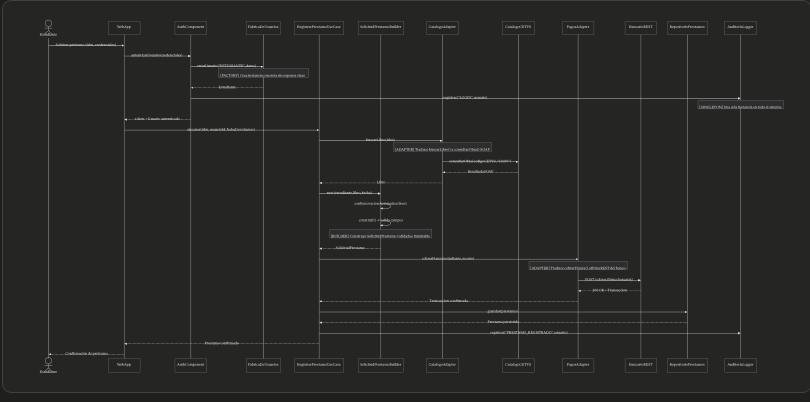

# Seccion Cuatro

**Pregunta 4 — Flujo completo**
Traza el flujo completo de la operación:
"Un estudiante solicita un préstamo y el sistema cobra la fianza al Sistema de Pagos Bancario."
Tu respuesta debe:
Mostrar qué clases o componentes participan en orden cronológico. Puedes usar un diagrama de secuencia simplificado.
Señalar en qué punto del flujo actúa cada uno de los 4 patrones estudiados.
Indicar en qué nivel C4 "vive" cada interacción del flujo.
Identificar una decisión arquitectónica que tomaste y justificar por qué es la correcta.
Esta pregunta evalúa que todos los conceptos funcionen en conjunto, no de forma aislada. No hay una única respuesta correcta si la justificación es sólida.

En el siguiente diagrama se puede observar en qué parte del flujo se utiliza cada patrón de diseño, esta decisión es una combinación de todos los patrones de diseño vistos en clase, y de esta manera se puede crear una aplicación completa y con buen manejo de datos/seguridad/responsabilidades siguiendo los principios SOLID.

