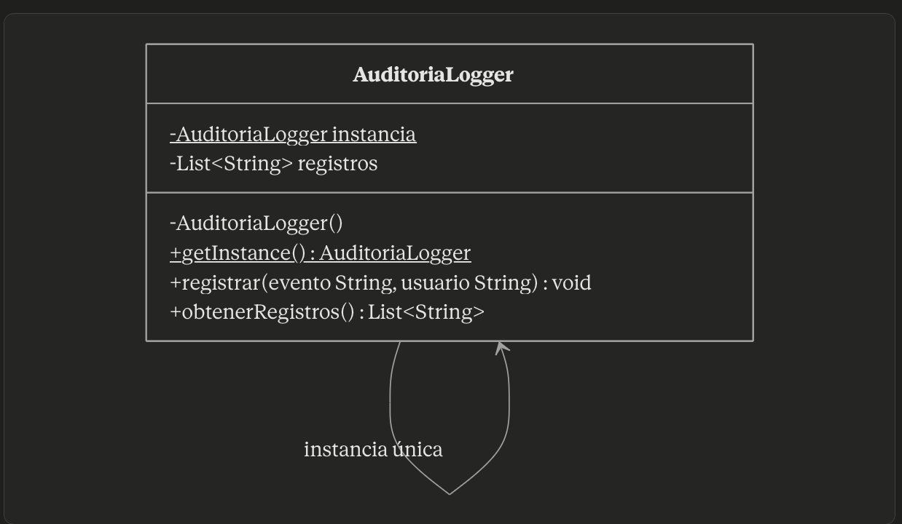
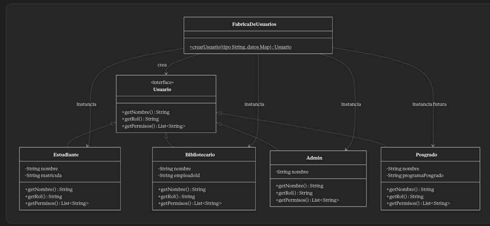
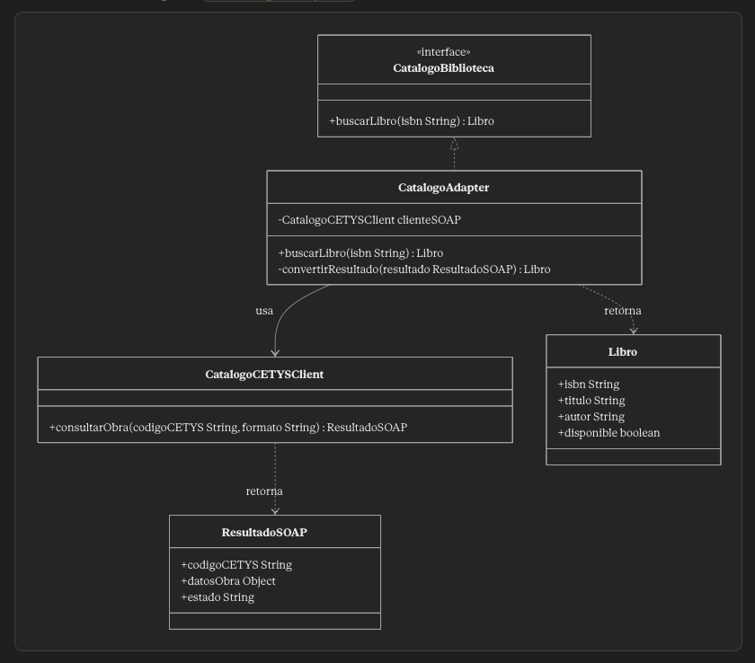
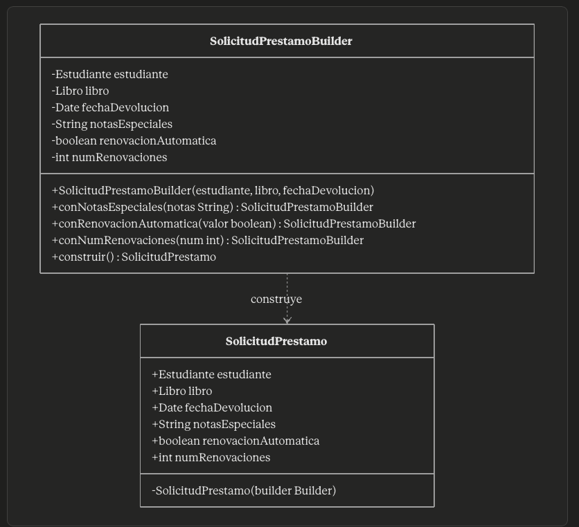

# Seccion Dos

**Pregunta 2A — Singleton · Registro de auditoría**
El rector exige que exista un único registro de auditoría en todo el sistema. Implementa la clase AuditoriaLogger usando el patrón Singleton. Tu solución debe:
Hacer imposible crear más de una instancia. Explica qué tuviste que hacer con el constructor y por qué.
Exponer el método registrar(evento: String, usuario: String).
Incluir el diagrama de clases UML resultante.
Reflexión: ¿qué problema concreto de este sistema resuelve tener una sola instancia? ¿Qué pasaría si hubiera dos instancias simultáneas?

El constructor se hace privado y get Instance un metodo estatico público, si la instancia es null crea una nueva y la entrega, si ya hay una regresa la instancia existente, esto evita crear múltiples instancias que tendrían algunos de sus registros por separado y no una sola fuente única de verdad.

[Link al Codigo](java/AuditoriaLogger.java)

**Pregunta 2B — Factory · Creación de usuarios**
El sistema debe crear objetos de tipo Usuario (Estudiante, Bibliotecario, Admin) sin que el código cliente conozca las clases concretas. Implementa una FabricaDeUsuarios y:
Define la interfaz Usuario con métodos comunes.
Implementa las tres clases concretas.
Dibuja el diagrama de clases UML con la fábrica y las implementaciones.
Muestra cómo agregar el tipo Posgrado en el futuro sin modificar el código existente. ¿Qué principio SOLID garantiza esto? Para agregar el tipo Posgrado hay que declarar que la clase implementa la interfaz usuario e implementar sus métodos, el principio SOLID que garantiza esto es el O, open to extension closed to modification.

[Clase Fabrica de Usuarios](java/FabricaDeUsuarios.java)
[Clase Administrador](/java/Administrador.java)
[Clase Estudiante](/java/Estudiante.java)
[Clase Bibliotecario](/java/Bibliotecario.java)

**Pregunta 2C — Adapter · Integración con el Catálogo CETYS**
El sistema interno espera una interfaz CatalogoBiblioteca con el método:
buscarLibro(isbn: String): Libro

El Catálogo CETYS expone el método:
consultarObra(codigoCETYS: String, formato: String): ResultadoSOAP

Con base en lo anterior:
Crea el adaptador que permita al sistema interno usar el catálogo CETYS sin modificar ninguna de las dos clases.
Dibuja el diagrama UML con las tres clases involucradas y sus relaciones.
Reflexión: si mañana CETYS cambia de proveedor de catálogo a uno con una interfaz completamente diferente, ¿cuánto código habría que modificar? ¿Por qué? Solamente se tendría que cambiar la clase adaptador y su implementacion de metodos que correspondan a la consulta del catalogo, lo demás se mantendrá por que no ocasiona que se rompa nada.

[Link a CatalogoAdapter](/java/CatalogoAdapter.java)
[Link a CatalogoCETYSClient](/java/CatalogoCETYSClient.java)
[Link a Libro](/java/Libro.java)
[Link a CatalogoBiblioteca](/java/CatalogoBiblioteca.java)

**Pregunta 2D — Builder · Solicitudes de préstamo**
Una SolicitudPrestamo tiene los siguientes atributos:
Atributo
Tipo
¿Obligatorio?
Default
estudiante
Estudiante
Sí
—
libro
Libro
Sí
—
fechaDevolucion
Date
Sí
—
notasEspeciales
String
No
null
renovacionAutomatica
boolean
No
false
numRenovaciones
int
No
1

Con base en esto:
Implementa un SolicitudPrestamoBuilder con métodos encadenables.
El método construir() debe validar que los campos obligatorios estén presentes antes de crear el objeto.
Muestra tres ejemplos de uso con distintas combinaciones de atributos opcionales.

SolicitudPrestamoBuilder s1 = new SolicitudPrestamoBuilder().setEstudiante(“Pedro”).setFechaDevolucion(“1-10-2027”).setLibro(“El mundo del Rubius”).construir();

SolicitudPrestamoBuilder s2 = new SolicitudPrestamoBuilder().setEstudiante(“Pepe”).setFechaDevolucion(“11-05-2026”).setLibro(“Elders Game”).setRenovacionAutomatica(true).construir();

SolicitudPrestamoBuilder s3 = new SolicitudPrestamoBuilder().setEstudiante(“Anuel”).setFechaDevolucion(“6-16-2026”).setLibro(“Los Juegos del Hambre”).setNumRenovaciones(2).setNotasEspeciales(“Gracias por prestarme el libro querido CETYS university”).construir();

Reflexión: ¿por qué conviene que SolicitudPrestamo sea inmutable una vez construida? ¿Qué problemas evitamos? Porque así luego no batallamos con que el cliente cambie características que no deberían de poder ser modificables y que están sujetas a nuestras reglas de negocio.

[Link al Codigo Builder](/java/SolicitudPrestamo.java)

