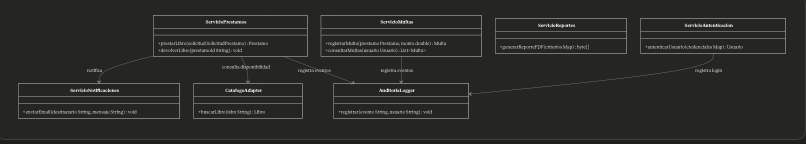
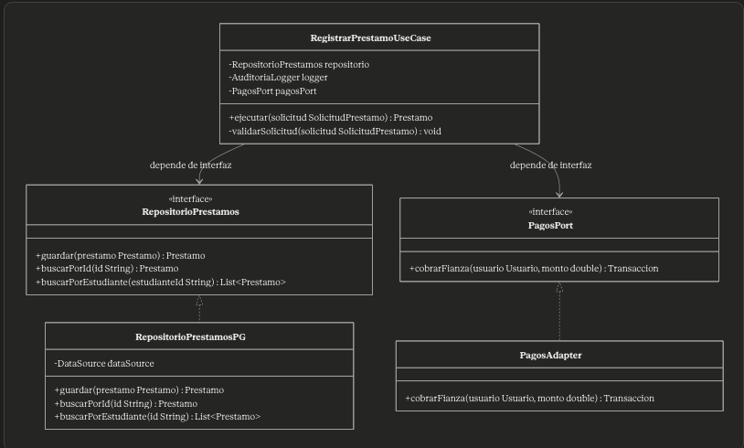

# Seccion Tres

**Pregunta 3A — Análisis de violaciones**
Se te entrega el siguiente diseño problemático. La clase GestorBiblioteca contiene los métodos:
prestarLibro()
devolverLibro()
registrarMulta()
enviarEmailNotificacion()
generarReportePDF()
autenticarUsuario()
consultarCatalogoCETYS()

Con base en lo anterior:
Identifica qué principios SOLID viola esta clase y explica por qué en cada caso. Viola la regla S de Single Responsibility, una clase debe tener una sola razon para cambiar, y en este caso esta clase se encarga de devolverLibro, registrar multas, autenticar usuarios, demasiadas responsabilidades.
Propón una refactorización: divide la clase en las entidades correctas. Dibuja el diagrama de clases resultante.
¿Cómo se relaciona esta refactorización con la Dependency Rule de Clean Architecture? Podemos inyectar la instancia singleton del logger para poder registrar cada operacion que el logger ejecute evitando crear multiples instancias del logger, ademas de que podemos inyectar herramientas que ocupen los servicios sin necesidad de crearlos en la clase, evitando esa responsabilidad.

**Pregunta 3B — Diseño de la capa de Use Cases**
Siguiendo Clean Architecture, el caso de uso "Registrar préstamo" debe ser independiente de la base de datos y del framework web.
Define la interfaz del repositorio RepositorioPrestamos y ubícala en la capa arquitectónica correcta. Justifica la ubicación.
Implementa la clase RegistrarPrestamoUseCase que use esa interfaz (no la implementación concreta).
Explica cómo la Dependency Rule garantiza que cambiar de MySQL a MongoDB no requiere tocar el use case. No se necesita cambiar el use case porque el use case solamente utiliza la interfaz que representa la conexión a la base de datos general, pero al momento de inyectar dicha base de datos se ocupa que la implementación concreta cumpla con los métodos de la interfaz, por lo que con la inyección de dependencia funciona sin problemas.
¿Qué patrón de los estudiados en clase aparece implícitamente en este diseño? DI, dependency injection e IoC(Inversion de control)

