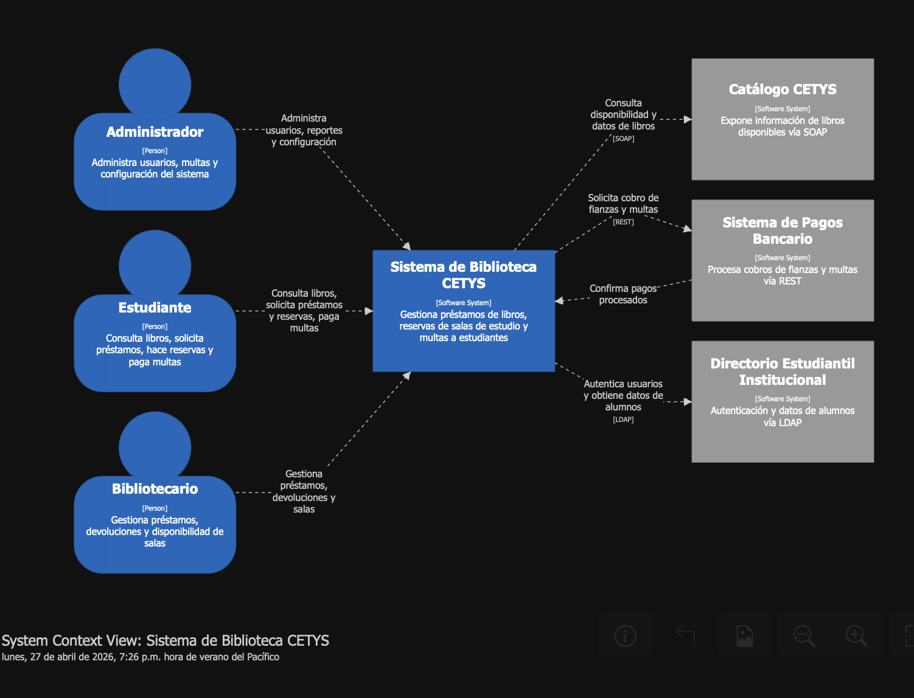
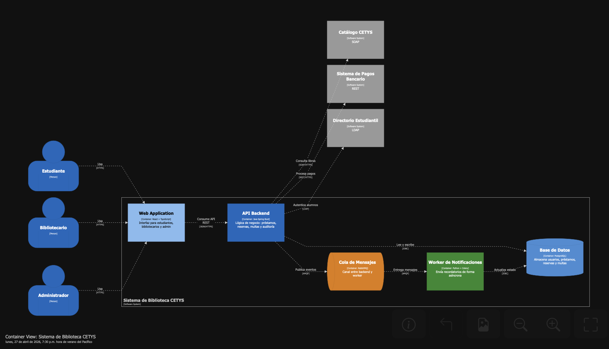
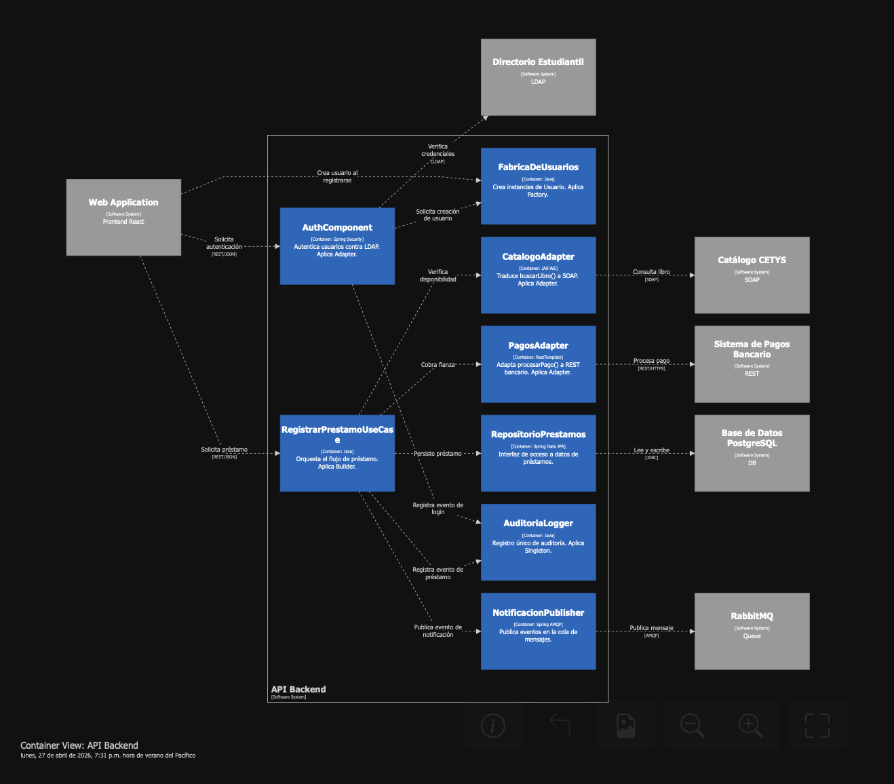

# Seccion Uno

Pregunta 1A — Diagrama de contexto 

Dibuja el diagrama de contexto del sistema (C4 nivel 1). Incluye:

El sistema en el centro con nombre y descripción de una línea.
Todos los actores humanos con sus roles.
Los tres sistemas externos. Indica la dirección y el propósito de cada relación.
Usa notación C4 clara: rectángulos etiquetados con nombre, tipo y descripción breve.

Codigo Structurizr
workspace "CETYS Biblioteca" "Sistema de gestión de préstamos, reservas y multas" {

  model {
    estudiante = person "Estudiante" "Consulta libros, solicita préstamos, hace reservas y paga multas"
    bibliotecario = person "Bibliotecario" "Gestiona préstamos, devoluciones y disponibilidad de salas"
    admin = person "Administrador" "Administra usuarios, multas y configuración del sistema"
    bancario = softwareSystem "Sistema de Pagos Bancario" "Procesa cobros de fianzas y multas vía REST" "External"

    catalogoCETYS = softwareSystem "Catálogo CETYS" "Expone información de libros disponibles vía SOAP" "External"
    directorio = softwareSystem "Directorio Estudiantil Institucional" "Autenticación y datos de alumnos vía LDAP" "External"

    biblioteca = softwareSystem "Sistema de Biblioteca CETYS" "Gestiona préstamos de libros, reservas de salas de estudio y multas a estudiantes"

    estudiante -> biblioteca "Consulta libros, solicita préstamos y reservas, paga multas"
    bibliotecario -> biblioteca "Gestiona préstamos, devoluciones y salas"
    admin -> biblioteca "Administra usuarios, reportes y configuración"
    bancario -> biblioteca "Confirma pagos procesados"

    biblioteca -> catalogoCETYS "Consulta disponibilidad y datos de libros" "SOAP"
    biblioteca -> bancario "Solicita cobro de fianzas y multas" "REST"
    biblioteca -> directorio "Autentica usuarios y obtiene datos de alumnos" "LDAP"
  }

  views {
    systemContext biblioteca "Contexto" {
      include *
      autoLayout
    }

    styles {
      element "Person" {
        shape Person
        background #1168BD
        color #ffffff
      }
      element "Software System" {
        background #1168BD
        color #ffffff
      }
      element "External" {
        background #999999
        color #ffffff
      }
    }
  }
}

Pregunta 1B — Diagrama de contenedores

Expande al nivel 2 (Containers). Descompón el sistema en al menos 4 contenedores (por ejemplo: Web App, API Backend, Base de Datos, Worker de Notificaciones). Para cada contenedor especifica:
Tecnología propuesta y justificación breve.
Responsabilidad principal.
Qué sistemas externos o actores se conectan a él y con qué protocolo.

*Contenedor 1*: Web Application como frontend para mostrar la pagina de biblioteca, tecnología react y typescript por la facilidad del desarrollo. Los sistemas que se conectan a la web application son la web API por medio del protocolo REST y utilizando de JSON para intercambiar información.

*Contenedor 2*: API Backend responsable de efectuar toda la lógica de negocios para poder llevar a cabo prestamos de libros. Tecnología a utilizar Java Spring Boot por la facilidad de crear sistemas robustos y seguros. Sus endpoints son usados por la web application a traves de REST y JSON, a su vez se comunica con el directorio estudiantil a traves de LDAP, el sistema de pagos bancario a traves de REST y con el catalogo de libros CETYS a traves del protocolo SOAP. También publica eventos a una cola de mensajes RabbitMQ2 a traves de AMQP. También se conecta a la base de datos correspondiente a traves de un JDBC.

*Contenedor 3*: Cola de mensajes, encargada de recibir los eventos que emita la API y enviarselos en orden FIFO al worker de notificaciones con el mismo porotocolo AMQP.

*Contenedor 4*: Worker de Notificaciones, worker encargado de enviar notificaciones, hecho con java y se conecta con la base de datos a traves de JDBC.

*Contenedor 5*: Base de Datos, punto unico de la información necesaria para poder llevar a cabo la parte central del sistema. Es una instancia de PostgreSQL por lo bueno que es y la facilidad de portabilidad en windows/mac/linux. Recibe lecturas y escrituras de la API y actualizaciones de estado del worker.

Contenedores
workspace "CETYS Biblioteca - Contenedores" {

  model {
    estudiante = person "Estudiante"
    bibliotecario = person "Bibliotecario"
    admin = person "Administrador"

    catalogoCETYS = softwareSystem "Catálogo CETYS" "SOAP" "External"
    bancario = softwareSystem "Sistema de Pagos Bancario" "REST" "External"
    directorio = softwareSystem "Directorio Estudiantil" "LDAP" "External"

    biblioteca = softwareSystem "Sistema de Biblioteca CETYS" {

      webApp = container "Web Application" "Interfaz para estudiantes, bibliotecarios y admin" "React + TypeScript" {
        tags "Frontend"
      }

      apiBackend = container "API Backend" "Lógica de negocio: préstamos, reservas, multas y auditoría" "Java Spring Boot" {
        tags "Backend"
      }

      baseDatos = container "Base de Datos" "Almacena usuarios, préstamos, reservas y multas" "PostgreSQL" {
        tags "Database"
      }

      workerNotificaciones = container "Worker de Notificaciones" "Envía recordatorios de forma asíncrona" "Python + Celery" {
        tags "Worker"
      }

      colaMensajes = container "Cola de Mensajes" "Canal entre backend y worker" "RabbitMQ" {
        tags "Queue"
      }
    }

    estudiante -> webApp "Usa" "HTTPS"
    bibliotecario -> webApp "Usa" "HTTPS"
    admin -> webApp "Usa" "HTTPS"

    webApp -> apiBackend "Consume API REST" "JSON/HTTPS"

    apiBackend -> baseDatos "Lee y escribe" "JDBC"
    apiBackend -> colaMensajes "Publica eventos" "AMQP"
    apiBackend -> catalogoCETYS "Consulta libros" "SOAP/HTTPS"
    apiBackend -> bancario "Procesa pagos" "REST/HTTPS"
    apiBackend -> directorio "Autentica alumnos" "LDAP"

    colaMensajes -> workerNotificaciones "Entrega mensajes" "AMQP"
    workerNotificaciones -> baseDatos "Actualiza estado" "JDBC"
  }

  views {
    container biblioteca "Contenedores" {
      include *
      autoLayout
    }

    styles {
      element "Person" {
        shape Person
        background #1168BD
        color #ffffff
      }
      element "Frontend" {
        background #85BBF0
        color #000000
      }
      element "Backend" {
        background #1168BD
        color #ffffff
      }
      element "Database" {
        shape Cylinder
        background #438DD5
        color #ffffff
      }
      element "Worker" {
        background #2D882D
        color #ffffff
      }
      element "Queue" {
        shape Pipe
        background #E07B00
        color #ffffff
      }
      element "External" {
        background #999999
        color #ffffff
      }
    }
  }
}

**Pregunta 1C — Diagrama de componentes**
Selecciona el contenedor API Backend y dibuja su diagrama de componentes (nivel 3). Identifica al menos 5 componentes internos y muestra cómo interactúan entre sí y con los sistemas externos. Incluye al menos un componente que aplique cada patrón cubierto en la sección 2.

*Auth Component*: Encargado de autentificar a los usuarios, interactua con el sistema de autenticación a través de LDAP y con la fabrica de usuarios para crear al usuario acorde.

*RegistrarPrestamoUseCase*: Encargado de hacer las llamadas necesarias a los servicios para ejecutar el registro de un prestamo, se conecta con el resto de los servicios disponibles.

*FabricaDeUsuarios*: Utiliza el patrón factory para crear un usuario dependiendo de su rol. Manda los usuarios a Auth Component

*CatalogoAdapter*: Se conecta con el sistema de catalogo de CETYS que incluye su propia interfaz para dar informacion, haciendo uso del patron adapter para conectar ambas interfaces.

*PagosAdapter*: Se encarga de poder traducir la información necesaria para poder mandar a llamar el sistema de pagos CETYS, usa el mismo patrón adapter que CatalogoAdapter.

*RepositorioPrestamos*: Encargado de comunicarse con la base de datos para poder efectuar escritura sobre ella con la información necesaria.

*AuditoriaLogger*: Encargado de escribir un log de logins para tener registro de quien realizó un prestamo, utiliza una instancia unica singleton como patrón de diseño.

*NotificationPublisher*: Publica eventos en la cola de mensajes.

Diagrama de Componentes
workspace "CETYS Biblioteca - Componentes API Backend" {

  model {
    webApp = softwareSystem "Web Application" "Frontend React" "External"
    catalogoCETYS = softwareSystem "Catálogo CETYS" "SOAP" "External"
    bancario = softwareSystem "Sistema de Pagos Bancario" "REST" "External"
    directorio = softwareSystem "Directorio Estudiantil" "LDAP" "External"
    baseDatos = softwareSystem "Base de Datos PostgreSQL" "DB" "External"
    colaMensajes = softwareSystem "RabbitMQ" "Queue" "External"

    apiBackend = softwareSystem "API Backend" {

      authComponent = container "AuthComponent" "Autentica usuarios contra LDAP. Aplica Adapter." "Spring Security"
      fabricaUsuarios = container "FabricaDeUsuarios" "Crea instancias de Usuario. Aplica Factory." "Java"
      prestamoUseCase = container "RegistrarPrestamoUseCase" "Orquesta el flujo de préstamo. Aplica Builder." "Java"
      catalogoAdapter = container "CatalogoAdapter" "Traduce buscarLibro() a SOAP. Aplica Adapter." "JAX-WS"
      pagosAdapter = container "PagosAdapter" "Adapta procesarPago() a REST bancario. Aplica Adapter." "RestTemplate"
      repositorioPrestamos = container "RepositorioPrestamos" "Interfaz de acceso a datos de préstamos." "Spring Data JPA"
      auditoriaLogger = container "AuditoriaLogger" "Registro único de auditoría. Aplica Singleton." "Java"
      notificacionPublisher = container "NotificacionPublisher" "Publica eventos en la cola de mensajes." "Spring AMQP"
    }

    webApp -> authComponent "Solicita autenticación" "REST/JSON"
    webApp -> prestamoUseCase "Solicita préstamo" "REST/JSON"
    webApp -> fabricaUsuarios "Crea usuario al registrarse"

    authComponent -> directorio "Verifica credenciales" "LDAP"
    authComponent -> fabricaUsuarios "Solicita creación de usuario"
    authComponent -> auditoriaLogger "Registra evento de login"

    prestamoUseCase -> catalogoAdapter "Verifica disponibilidad"
    prestamoUseCase -> pagosAdapter "Cobra fianza"
    prestamoUseCase -> repositorioPrestamos "Persiste préstamo"
    prestamoUseCase -> auditoriaLogger "Registra evento de préstamo"
    prestamoUseCase -> notificacionPublisher "Publica evento de notificación"

    catalogoAdapter -> catalogoCETYS "Consulta libro" "SOAP"
    pagosAdapter -> bancario "Procesa pago" "REST/HTTPS"
    repositorioPrestamos -> baseDatos "Lee y escribe" "JDBC"
    notificacionPublisher -> colaMensajes "Publica mensaje" "AMQP"
  }

  views {
    container apiBackend "Componentes_API" {
      include *
      autoLayout
    }

    styles {
      element "External" {
        background #999999
        color #ffffff
      }
      element "Container" {
        background #1168BD
        color #ffffff
      }
    }
  }
}

